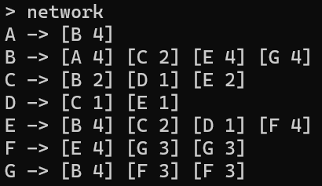
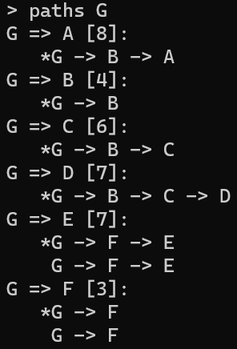
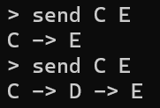

# ECMP Routing

A C++ console application to simulate the working of ECMP balanced round-robbin packet transmission.

The application has a command-line interface that supports the following commands:

- `network`: Prints the network graph as an adjacency list.
- `paths [src [dst]]`: Displays all the paths in the network along with their cost. If `src` or `dst` are provided, only paths with those endpoints are shows.
- `send src dst`: Transmits a packet from `src` to `dst` router, and returns the paths taken.
- `exit`: Terminates the application.

## Network File Format

The program reads network description from `network.txt`. The file defines the connections between routers and each link is considered to be undirected.

Each line of the file is of the form `router1 router2 cost`. Every connection should be unique, i.e., if `router1 router2 cost` is present in the file, don't include `router2 router1 cost`.

`network.txt` should be of the present in the directory from which you launch the application.

## Requirements

The project was developed and tested on Windows, with MinGW `g++` compiler and `C++17`.

## Build Instructions

To build the project:

```
g++ -std=c++17 main.cpp libs/network/network.cpp libs/router/router.cpp libs/cli/cli.cpp -Ilibs -o bin\main.exe
```

Alternatively, to build and run the application execute the `build.bat` script.

## Results





*\* denotes the next path to be taken for transmission*



